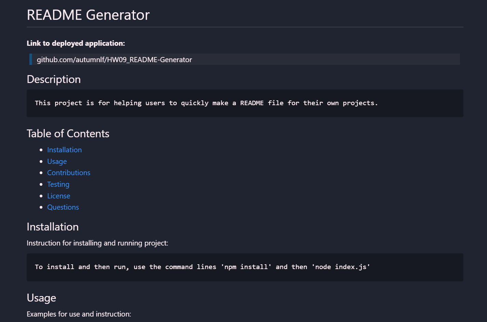
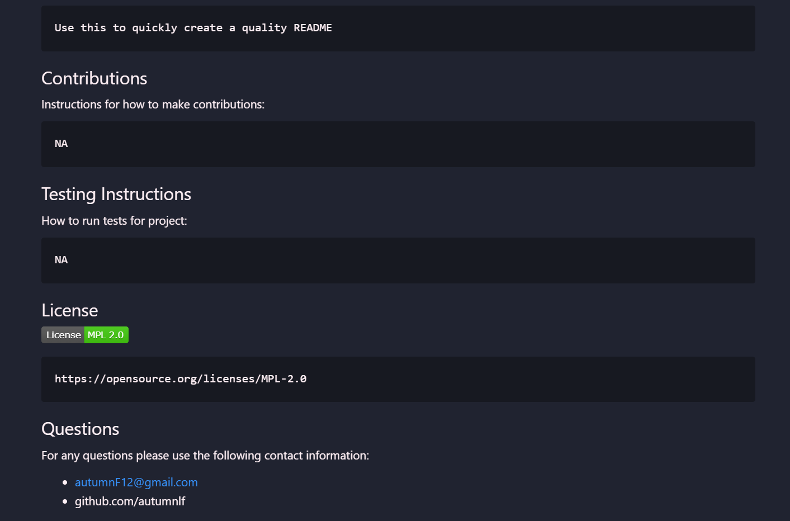

# HW09_README-Generator

**Link to github repository:**
> https://github.com/autumnlf/HW09_README-Generator

## Description
    For this homework assignment we are tasked with creating a README generator using node.js. We are given some starter code that we are asked to build off of.

Acceptance Criteria:

    GIVEN a command-line application that accepts user input
    WHEN I am prompted for information about my application repository
    THEN a high-quality, professional README.md is generated with the title of my project and sections entitled Description, Table of Contents, Installation, Usage, License, Contributing, Tests, and Questions
    WHEN I enter my project title
    THEN this is displayed as the title of the README
    WHEN I enter a description, installation instructions, usage information, contribution guidelines, and test instructions
    THEN this information is added to the sections of the README entitled Description, Installation, Usage, Contributing, and Tests
    WHEN I choose a license for my application from a list of options
    THEN a badge for that license is added near the top of the README and a notice is added to the section of the README entitled License that explains which license the application is covered under
    WHEN I enter my GitHub username
    THEN this is added to the section of the README entitled Questions, with a link to my GitHub profile
    WHEN I enter my email address
    THEN this is added to the section of the README entitled Questions, with instructions on how to reach me with additional questions
    WHEN I click on the links in the Table of Contents
    THEN I am taken to the corresponding section of the README

## Sources:

Thank you to Lukas-H on Github Gist for their markdown file where I was able to source the license badges and license links. You can find the gist at: 
* https://gist.github.com/lukas-h/2a5d00690736b4c3a7ba

## Screenshots:
* Example of a generated README

Video of going through command line prompts and viewing the generated README
>https://drive.google.com/file/d/1Nn5YuJiXuStMulISsdrzWfNnTMI2Nczd/view?usp=sharing

